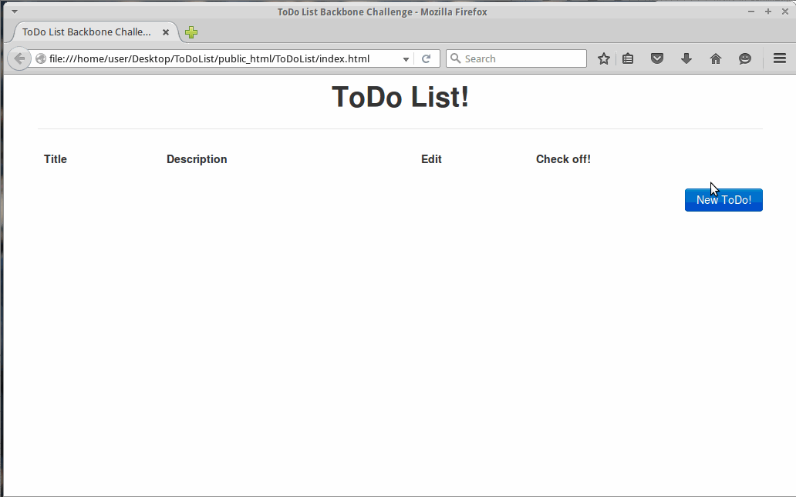

# ToDoList



### How to install on a webserver

1. Copy the contents of public_html to your website directory

<br />

### Setting up a custom server
Get redis-server installed with
 ```shell
sudo apt-get install redis-server
 ```
In a seperate terminal, make sure the redis-server is running with

 ```shell
redis-server
 ```
Change the line in todo.js from my heroku server to your server

```javascript
$.ajaxPrefilter( function( options, originalOptions, jqXHR ) {
                options.url = 'http://your-url-here.com' + options.url;
    });
```

Download node.js and run

 ```shell
node index.js
 ```
 
Done!
